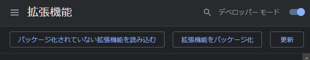
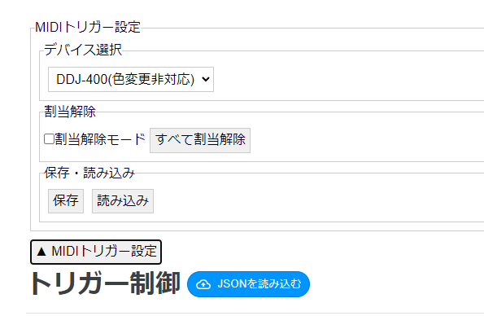

# MidiWebTrigger

clusterのトリガー操作画面にMidi制御設定を追加します。

## 導入方法

Chromeの拡張機能ページ（[chrome://extensions/](chrome://extensions/)）で、デベロッパーモードを有効にして、パッケージ化されていない拡張機能を読み込むを選択します。

## 使用方法

## 操作方法

- デバイス選択：対象のデバイスを選択します。
- 割当解除
    - 割当解除モード：有効にした状態でPadを選択すると、その割当を解除します。
    - すべて割当解除：すべてのボタンの割当を解除します。
- 保存・読み込み：
    - 保存：現在のプリセットを保存します。
    - 読み込み：プリセットを読み込みます。トリガーのJSONが読み込まれていない場合色変更は行いません。

## 問い合わせ

[Discordサーバー](https://discord.gg/Wz24z35FNu)の制作物カテゴリにお願いします。